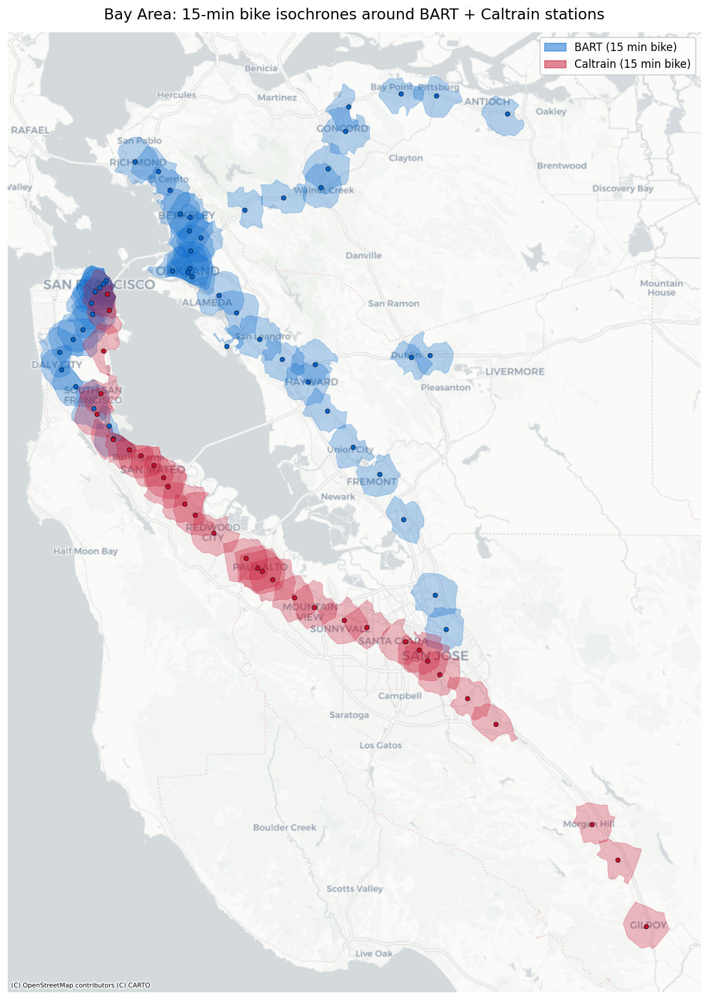

# Bay Area BART + Caltrain — 15-min Bike Isochrones

An interactive map showing every area within a 15-minute bike ride of every
BART and Caltrain station in the Bay Area.

Isochrones are computed offline from OpenStreetMap's bike-friendly street
network (via [OSMnx](https://osmnx.readthedocs.io/)). No API keys, no signups,
no cloud services.

[](https://vignesh-anand.github.io/bay-area-bike-isochrones/)

**[Click the map for the interactive version](https://vignesh-anand.github.io/bay-area-bike-isochrones/)** — pan, zoom, click stations, toggle BART vs Caltrain layers.

You can also drag [`isochrones.geojson`](#exporting) onto [geojson.io](https://geojson.io) or [kepler.gl](https://kepler.gl), or open [`bay_area_bike_isochrones.kml`](#exporting) in Google Earth.

## Motivation

I'm exploring whether **car-free living is realistic in the Bay Area**, and
the practical answer hinges on a question this map tries to make concrete:

> *Where can I actually live, work, and run errands using only a bike +
> Caltrain/BART?*

For most everyday trips, a 15-minute bike ride to a station is the upper
bound of what feels effortless and repeatable — short enough to do daily
without sweating through work clothes, long enough to extend the practical
catchment of each station from a 0.5-mile walkshed (~10x area) to a
3-4 km bikeshed.

Layering all 81 station bikesheds together shows the **true union of places
in the Bay Area where car-free living is genuinely viable**: where you can
get to a regional rail line by bike in under 15 minutes, and from there
reach the rest of the network. Areas inside the colored polygons are
candidate neighborhoods to live, work, or look for housing. Areas outside
either require a car, an e-bike, or a longer transit ride.

The dark, blended overlaps (several station bikesheds stacked) are the most
flexible spots — multiple stations to choose from, redundant transit, often
walkable too.

## Quickstart

```bash
python3 -m venv .venv
source .venv/bin/activate
pip install -r requirements.txt
python build_map.py
```

Then open `bay_area_bike_isochrones.html` in any browser.

The first run downloads a small ~5 km bike-network bbox around each of the
81 stations from OpenStreetMap and computes the reachable area. With 4
parallel workers it takes roughly **20-30 minutes**. Results are cached:

- OSM responses are cached on disk in `./cache/`, so re-running is fast.
- Final isochrones are written to `./isochrones.geojson` and reused on
  subsequent runs.

To skip the compute step entirely and just re-render the map from the
existing GeoJSON:

```bash
python build_map.py --map-only
```

To force a full recompute (e.g. after changing speed/duration):

```bash
python build_map.py --rebuild
```

To use more or fewer parallel workers:

```bash
python build_map.py --workers 8
```

The default is 4, which matches the main Overpass API's per-IP slot limit.
Going higher leads to throttling.

## How it works

1. Loads `stations.csv` (50 BART + 31 Caltrain stations, with coordinates
   pulled from each agency's public GTFS feed).
2. For each station (in parallel), downloads a 5 km bike-network bbox from
   OSM via OSMnx.
3. Sets each edge's `travel_time = length / bike_speed` (default
   **15 km/h**, configurable in `build_map.py`).
4. Builds a KDTree of the graph's nodes and finds the one nearest the
   station.
5. Computes the [ego graph](https://networkx.org/documentation/stable/reference/generated/networkx.generators.ego.ego_graph.html)
   of nodes reachable within 15 × 60 = 900 seconds along bike-friendly
   roads.
6. Wraps the reachable nodes in Shapely 2's built-in `concave_hull`
   (ratio=0.3) to produce a realistic polygon. Falls back to convex hull
   if needed.
7. Renders all polygons on a Folium / Leaflet map with toggleable layers
   per agency, color-coded markers, tooltips, and a legend.

## Tuning

Edit the constants at the top of `build_map.py`:

```python
BIKE_SPEED_KMH = 15.0   # average urban cycling speed
RIDE_MINUTES = 15       # isochrone duration
BBOX_RADIUS_M = 5000    # OSM data fetched per station; should be > speed*time
```

Then re-run with `--rebuild`.

## Files

- `stations.csv` — agency, name, lat, lon for every station.
- `build_map.py` — end-to-end script (compute + render).
- `render_preview.py` — generates the static PNG used in this README.
- `requirements.txt` — Python dependencies.
- `docs/index.html` — the interactive map, deployed to GitHub Pages.
- `docs/preview.png` — static map embedded above.
- `cache/` (generated) — OSMnx HTTP response cache.
- `isochrones.geojson` (generated) — one Polygon feature per station.

## Exporting

The script produces several formats so you can use the data wherever:

| Output | Format | Use it in |
|---|---|---|
| `bay_area_bike_isochrones.html` | Folium / Leaflet HTML | Any browser (also deployed to GitHub Pages) |
| `bay_area_bike_isochrones.kml` (with `--kml`) | KML | Google Earth Pro / Web, Google My Maps |
| `isochrones.geojson` | GeoJSON | QGIS, [geojson.io](https://geojson.io), [kepler.gl](https://kepler.gl), [Felt](https://felt.com), Mapbox, ArcGIS |

```bash
python build_map.py --map-only --kml   # re-render outputs without recomputing
python render_preview.py               # regenerate the static PNG for this README
```

## Caveats

- Bike speed is a single global average; real speed depends on terrain,
  traffic, rider fitness, and stoplights.
- The bike network type filters out freeways but doesn't distinguish
  protected bike lanes from busy stroads.
- Isochrones don't account for elevation — Bay Area hills will significantly
  reduce uphill range.
- Polygons are concave hulls of reachable graph nodes, so they may slightly
  overshoot the true reachable area on the boundary.
